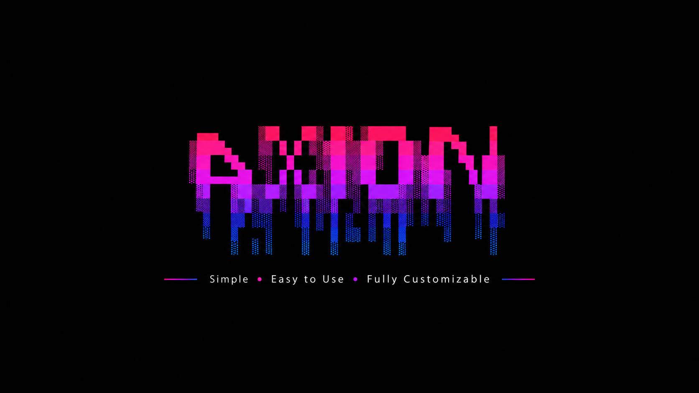

# Axion



<p align="center">
  <b>Simple • Lightweight • Open-Source</b>
</p>

<p align="center">
  
  
  
  
  
</p>

<p align="center">
  
  
  
</p>

## About

Axion is a simple, lightweight and open-source multitool.

It is designed to be fast, easy to use and highly customizable.

Axion currently supports:

- Windows 10
- Windows 11
- Linux

A macOS edition is also currently being tested and will be available soon.

A native Windows `.EXE` version is also planned.

Axion is continuously evolving with new tools, platform support, animations and interface improvements.

## Features

- Lightweight interface
- Animated startup screen
- Animated AXION logo
- Moving pink, purple and blue colors
- Centered loading animation
- Quick tool launcher
- Simple navigation
- Multiple tool categories
- Easy to customize
- Open-source
- Windows 10 support
- Windows 11 support
- Linux support
- macOS edition in testing
- More tools and features planned

## Windows v2.2 Highlights

Axion v2.2 introduces several visual improvements and new features to the Windows edition.

### New Startup Experience

The Windows edition now includes a new animated startup screen.

It includes:

- Animated AXION logo
- Moving pink, purple and blue colors
- Large centered loading bar
- Approximately 3.3 seconds of loading animation
- `INITIALIZING AXION` message
- `AXION LOADED` message
- `READY` state
- `PRESS ENTER TO LAUNCH AXION`
- Continuous logo animation while waiting
- Axion launches after pressing Enter

Once Enter is pressed, the startup screen is cleared and the normal Axion interface is displayed.

### Interface Improvements

- Improved interface centering
- Improved spacing and alignment
- Better centered GitHub repository link
- Added a `WINDOWS EDITION` indicator in the top-right corner
- Added the current Axion version under the Windows Edition indicator
- General visual improvements

### New Tools

Axion v2.2 also adds:

- Speedtest
- GitHub

## Current Tools

### Internet

- Website
- Speedtest

### Social Networks

- Discord
- YouTube
- GitHub

### Applications

- Roblox

More tools will be added in future updates.

## Current Versions

| Platform | Version | Status |
|---|---|---|
| Windows | v2.2.0 | ✅ Supported |
| Linux | lnx-v1.0.0 | ✅ Supported |
| macOS | mac-v1.0.0 | 🧪 Testing |

Each platform has its own version numbering.

## Windows

Current version:

`v2.2.0`

Windows is the original stable edition of Axion.

Supported systems:

- Windows 10
- Windows 11

The Windows edition uses Batch scripts and includes the latest Axion interface, startup animations and tools.

## Linux

Current version:

`lnx-v1.0.0`

Axion LNX is the Linux-compatible edition of Axion.

It uses Bash and Linux-compatible commands while keeping the same Axion concept, interface and tools.

Axion LNX is currently supported.

### Linux Compatibility

Axion LNX has currently only been tested on **Omarchy**.

✅ Tested distribution:

- Omarchy

Since Axion uses Bash and common Linux commands, it is expected to work on most desktop Linux distributions.

This may include distributions such as:

- Ubuntu
- Linux Mint
- Debian
- Fedora
- Arch Linux
- Manjaro
- Other desktop Linux distributions

However, compatibility with every Linux distribution has not yet been individually verified.

If you test Axion on another Linux distribution, you are welcome to report whether it works correctly.

## macOS

Current macOS edition:

`mac-v1.0.0`

Axion MAC is the macOS-compatible edition of Axion.

It uses macOS-compatible shell scripts and commands while keeping the same Axion concept and interface.

The macOS edition is currently undergoing testing.

It is not yet considered fully stable.

## Installation

### Windows

⚠️ Make sure you select a **Windows release**, not the Linux or macOS release.

1. Go to the Axion Releases page
2. Select the latest Windows release
3. Look for a release tag beginning with:

`v`

For example:

`v2.2.0`

4. Download the official Windows ZIP from the **Assets** section:

`Axion-Windows-v2.2.0.zip`

5. Extract the ZIP file
6. Open the Axion folder
7. Run:

`Axion.bat`

Axion will display its startup animation.

Once the loading screen displays:

`PRESS ENTER TO LAUNCH AXION`

press **Enter** to open the main interface.

### Linux

⚠️ **Important: make sure you select the Linux release.**

Linux releases use tags such as:

`lnx-v1.0.0`

Do **not** download a Windows or macOS release if you are using Linux.

1. Go to the Axion Releases page
2. Find the latest release with a tag beginning with:

`lnx-`

3. Download the official Linux package from the **Assets** section:

`Axion-LNX-v1.0.0.zip`

4. Extract the ZIP file
5. Open a terminal inside the extracted Axion folder
6. Run:

```bash
sed -i 's/\r$//' Axion.sh fils/*.sh
```

7. Then launch Axion with:

```bash
bash Axion.sh
```

Axion should now start normally.

### Optional Linux Setup

If you want to make Axion directly executable, run:

```bash
chmod +x Axion.sh fils/*.sh
```

You can then launch Axion with:

```bash
./Axion.sh
```

## macOS Installation

⚠️ Make sure you select a **macOS release**, not the Windows or Linux release.

macOS releases use tags such as:

`mac-v1.0.0`

The macOS edition is currently being tested and is not yet considered fully stable.

1. Download the official macOS ZIP from the **Assets** section:

`Axion-MAC-v1.0.0.zip`

2. Extract the ZIP file
3. Open Terminal inside the Axion folder
4. Run:

```bash
bash Axion.sh
```

## Platform Status

### Windows

✅ Supported

- Windows 10
- Windows 11
- Current version: `v2.2.0`
- Animated startup screen
- Latest interface improvements
- Latest Windows tools

### Linux

✅ Supported

- Current version: `lnx-v1.0.0`
- Currently tested on Omarchy
- Expected to work on most desktop Linux distributions
- Compatibility with every distribution has not yet been individually verified

### macOS

🧪 Testing

- Current edition: `mac-v1.0.0`
- Compatibility testing in progress
- Public stable support coming soon

### Native EXE

🚧 Coming Soon

A native `.EXE` edition of Axion is planned for Windows.

## Upcoming Updates

### Coming Soon

- [ ] Native `.EXE` version
- [ ] macOS stable release
- [ ] More tools
- [ ] Better customization
- [ ] New categories and features
- [ ] Additional interface improvements

### Future

- [ ] Advanced settings
- [ ] Additional platform improvements
- [ ] More cross-platform tools
- [ ] More Linux distribution testing
- [ ] Additional startup customization
- [ ] More animations and visual effects

## Customization

Axion can be customized to fit your needs.

You can modify:

- Colors
- Menu options
- Links
- Tools
- Categories
- Logo
- Interface design
- Startup animation
- Loading screen
- Launch options

## Open Source

Axion is completely open-source.

You are free to:

- Explore the source code
- Modify Axion
- Customize the interface
- Add your own tools
- Improve existing features
- Modify the startup animation
- Create your own version

## View the Source Code

You can inspect Axion directly on GitHub without downloading it.

### Windows

Main script:

`Axion.bat`

Tool scripts are located inside:

`fils/`

Windows tool scripts use the `.bat` extension.

### Linux

Main script:

`Axion.sh`

Tool scripts are located inside:

`fils/`

Linux scripts use the `.sh` extension.

### macOS

Main script:

`Axion.sh`

Tool scripts are located inside:

`fils/`

macOS scripts also use the `.sh` extension.

## Version History

### Windows

- `v1.0.0` — First Windows version
- `v1.5.0` — Interface and tool improvements
- `v2.0.0` — Major interface redesign
- `v2.1.0` — Additional interface and compatibility improvements
- `v2.2.0` — New startup animation, interface improvements, Speedtest and GitHub tools

### Linux

- `lnx-v1.0.0` — First official Linux edition

Currently tested on **Omarchy**.

### macOS

- `mac-v1.0.0` — First macOS edition

Currently in testing.

## Important Download Notice ⚠️

Axion has separate releases for each operating system.

Make sure you download the correct edition for your system:

| System | Edition Name | Release Tag |
|---|---|---|
| Windows | Axion | `v...` |
| Linux | Axion LNX | `lnx-v...` |
| macOS | Axion MAC | `mac-v...` |

For example:

- Windows → `v2.2.0`
- Linux → `lnx-v1.0.0`
- macOS → `mac-v1.0.0`

### Official Packages

Download the package made for your operating system:

- Windows → `Axion-Windows-v2.2.0.zip`
- Linux → `Axion-LNX-v1.0.0.zip`
- macOS → `Axion-MAC-v1.0.0.zip`

Do **not** download a version made for another operating system.

For example:

- Do not use the Windows version on Linux
- Do not use Axion LNX on macOS
- Do not use Axion MAC on Windows

When downloading Axion from a GitHub Release, always use the official ZIP located in the **Assets** section.

Do **not** download:

- `Source code (zip)`
- `Source code (tar.gz)`

These files are automatically generated by GitHub and contain the complete repository, including files that are not required to run Axion.

Always download the official Axion package made specifically for your operating system.

---

<p align="center">
  Made with ❤️ by ScripthubDev
</p>
