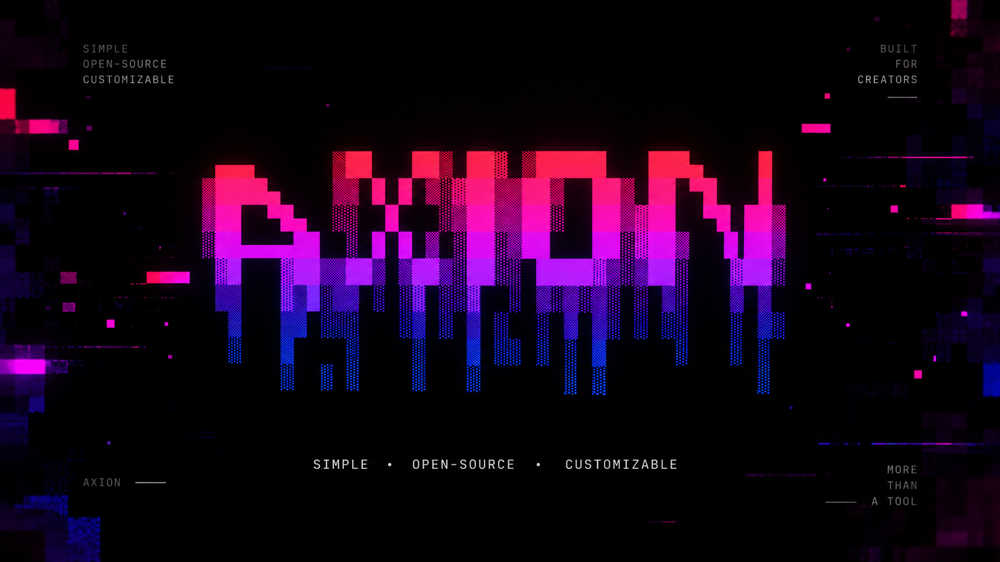

# Axion

  <b>Simple • Lightweight • Open-Source</b>

  
  
  
  

## About

Axion is a simple, lightweight and open-source multitool built for Windows.

It features a clean CMD interface, quick access to useful tools, and is easy to customize.

The project is designed to stay simple, fast and accessible for anyone who wants to modify or expand it.

## Features

- Clean CMD interface
- Quick tool launcher
- Lightweight
- Easy to customize
- Open-source
- Built for Windows

## Installation

1. Download `AXION.zip`
2. Extract the ZIP file
3. Open the Axion folder
4. Run `Axion.bat`

## Preview

A screenshot of Axion will be added here soon.

## Customization

Axion is designed to be easy to modify.

You can customize:
- Colors
- Menu options
- Links
- Tools
- Logo
- CMD design

## Roadmap

- [x] Main Axion interface
- [x] Custom design
- [x] Quick launch tools
- [ ] Settings menu
- [ ] More tools
- [ ] Better customization
- [ ] Future updates

## Open Source

Axion is open-source and can be modified to fit your own needs.

Feel free to explore the code and create your own version.

---

  Made with ❤️ by ScriptHub

